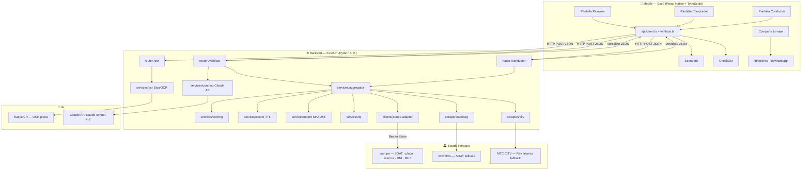

# Arquitectura — SubeSeguro

App mobile-first que, desde una **placa**, devuelve un veredicto 🟢/🟡/🔴 combinando datos oficiales del Estado peruano.

---

## Visión general



El backend es un **proxy delgado**: guarda el token json.pe, normaliza, cachea por placa, calcula el veredicto. La app es un cliente delgado: captura, muestra, comparte.

---

## Capas del backend

| Capa | Módulo | Responsabilidad |
|------|--------|-----------------|
| **Routers** | `routers/verificar.py`, `conductor.py`, `ocr.py` | HTTP, validación de entrada, normalización de placa |
| **Orquestación** | `services/aggregator.py` | Reúne fuentes por módulo, degradación elegante, cache |
| **Dominio** | `models.py` | Modelos pydantic estables — el contrato interno |
| **Reglas** | `services/scoring.py` | Señales → `Check` → `Veredicto` (peor de las señales) |
| **Datos** | `clients/jsonpe.py` | Cliente json.pe + **adapter** (único lugar que conoce los nombres de campos del proveedor) |
| **Fallback** | `scrapers/apeseg.py`, `citv.py` | SOAT / revisión técnica cuando json.pe no trae el dato |
| **Soporte** | `services/cache.py`, `report.py`, `qr.py`, `ocr.py`, `contract.py` | TTL cache, firma SHA-256, QR, OCR, contratos (Claude) |

### Principio clave — el adapter como cortafuegos

Los shapes de json.pe son **inestables y no documentados**. Todo el parseo del proveedor vive en `clients/jsonpe.py` y se valida contra la API en vivo antes de confiar en él. Nada fuera de `clients/` y `scrapers/` ve JSON crudo del proveedor — solo modelos `VehiculoInfo`, `SoatInfo`, `LicenciaInfo`. Si json.pe cambia un campo, se toca **un** archivo.

---

## Flujo: módulo Pasajero

```
1. Usuario escribe / fotografía placa
2. (foto) POST /ocr/placa  → EasyOCR → candidatas → prefill
3. POST /verificar/pasajero {placa}
4. Aggregator:
     cache.get("pasajero:PLACA")  → hit? devuelve
     jsonpe.get_soat()      → soat_check()        ┐
     jsonpe.get_vehiculo()  → vehiculo_check()    ├─ cada fuente que falla = 🟡 (nunca 500)
     citv.fetch_revision()  → check               ┘
     construir_veredicto()  = peor_color(checks)
     cache.set(...)
5. App: Semaforo + CheckList + "Comparte tu viaje"
```

---

## Modelo de datos (contrato interno)

```
Veredicto { color, resumen, placa, checks[] }
Check     { clave, etiqueta, color, detalle, fuente, consultado_en }
color ∈ { verde, ambar, rojo, desconocido }
```

Cada `Check` SIEMPRE lleva `fuente` + `consultado_en` (UTC ISO-8601). Detalle del contrato HTTP en [API.md](API.md).

---

## Reglas de veredicto (peor de las señales)

`color final = max(rojo > ámbar > verde)`. Una señal desconocida/error cuenta como **ámbar**, nunca verde.

| Señal | 🔴 rojo | 🟡 ámbar | 🟢 verde |
|-------|---------|----------|----------|
| SOAT | vencido | no confirmable · vence ≤30 días | vigente >30 días |
| Vehículo | — | datos no confirmables | marca+modelo presentes |
| Licencia | no vigente | no confirmable | vigente |
| Revisión técnica | no vigente | no confirmable | vigente |

---

## Decisiones de diseño

Ver [DECISIONES.md](DECISIONES.md) (json.pe único proveedor, peor-de-señales, sin persistencia, features diferidas).

## Seguridad y privacidad

Ver [SEGURIDAD.md](SEGURIDAD.md) (no persistencia de datos de vehículo, fuente+timestamp, firma SHA-256, QR en tiempo real).
