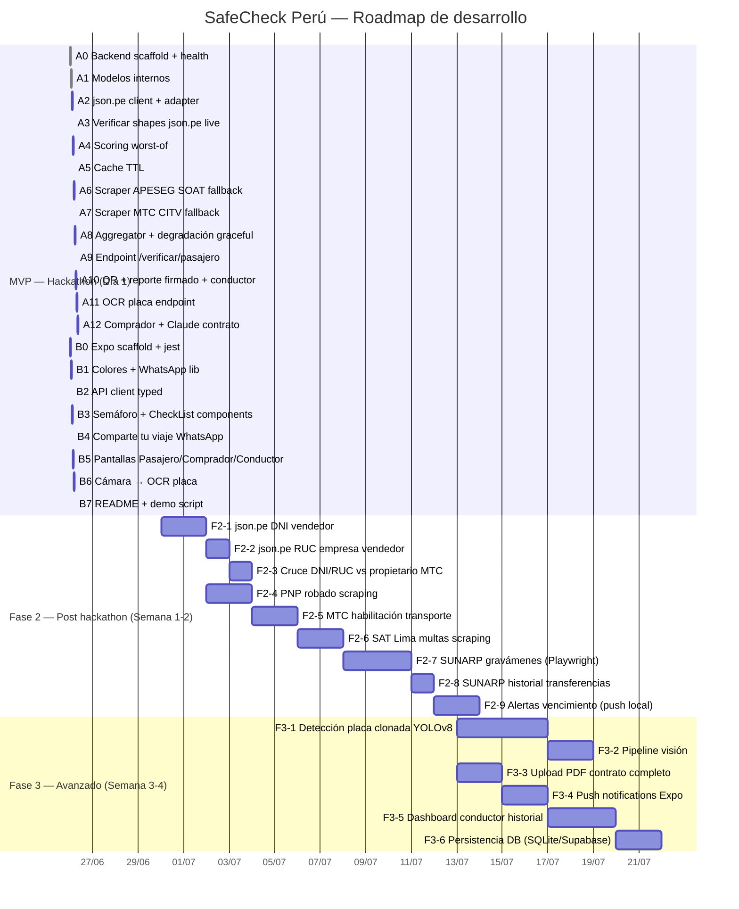

# Gantt — SafeCheck Perú

---

## Resumen por fase

### MVP — Hackathon (26 Jun, 8 horas)
**Backend (Tasks A0–A12):**
- Scaffold FastAPI + health check
- Modelos internos (Veredicto, Check, SoatInfo...)
- Cliente json.pe (vehículo + SOAT + licencia)
- Scoring worst-of (🔴🟡🟢)
- Cache TTL en memoria
- Scrapers fallback: APESEG (SOAT) + MTC CITV (rev. técnica)
- Aggregator con degradación graceful
- Endpoints: `/verificar/pasajero`, `/verificar/comprador`, `/conductor/qr`, `/ocr/placa`
- QR dinámico + reporte firmado SHA-256
- Análisis contrato con Claude API

**Mobile (Tasks B0–B7):**
- Expo + React Native + TypeScript + jest
- Pantallas: Pasajero, Comprador, Conductor
- Semáforo + CheckList + "Comparte tu viaje"
- Cámara → OCR → autocompletar placa

**Features cubiertos:** P1–P4, P6, P9–P11, C1, C5, C6, D1–D4

---

### Fase 2 — Semana 1-2 post hackathon
- DNI/RUC vendedor vía json.pe → cruces de identidad
- PNP vehículo robado
- MTC habilitación transporte público / taxi
- SAT Lima multas pendientes
- SUNARP gravámenes e historial de transferencias
- Alertas de vencimiento (SOAT, rev. técnica)

**Features cubiertos:** P5, P7, C2–C4, C7–C9, D5

---

### Fase 3 — Semana 3-4
- Detección placa clonada con YOLOv8 (color/tipo foto vs datos MTC)
- Upload PDF completo con OCR
- Push notifications Expo
- Dashboard historial conductor
- Persistencia con base de datos

**Features cubiertos:** P8, D6, D7
